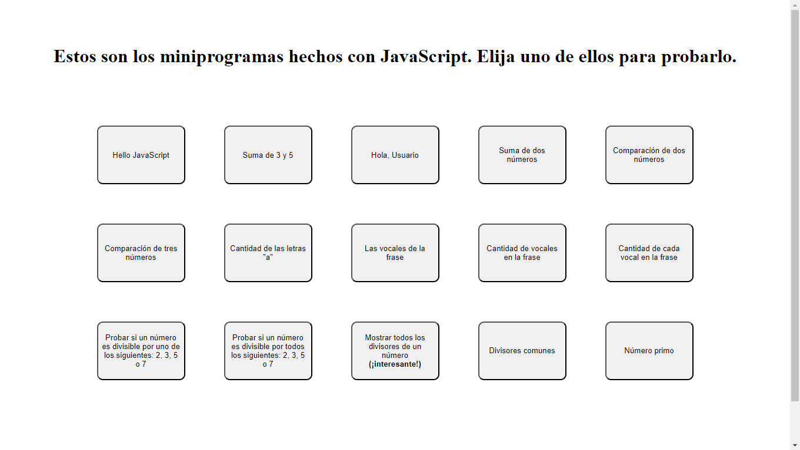

# JS Exercises by Factoria F5

## GitHub Pages link

https://markwebdeveloper.github.io/JS-Exercises/

## Screenshot

## The exercises are following

1. Program that says "Hello Javascript"
2. Program that says "The sum of 3 and 5 is"
3. Program that says "Hello User" (takes username from input) 
4. Program that gives a sum of 2 numbers
5. Program that compares 2 numbers
6. Program that compares 3 numbers
7. Program that counts the letter "a" in a frase 
8. Program that shows the vocals that appear in a frase
9. Program that shows the quantity of vocals in a frase
10. Program that shows the quantity of every vocal in a frase
11. Program that shows if a number is divisible by 2, 3, 5 or 7 (only shows 1 of 4)
12. Program that shows if a number is divisible by 2, 3, 5 or 7 (shows several if possible)
13. Program that shows all the dividers of a number
14. Program that takes two numbers and shows their common dividers
15. Program that shows if a number is prime

# Try them! It's fun. Well, sometimes...